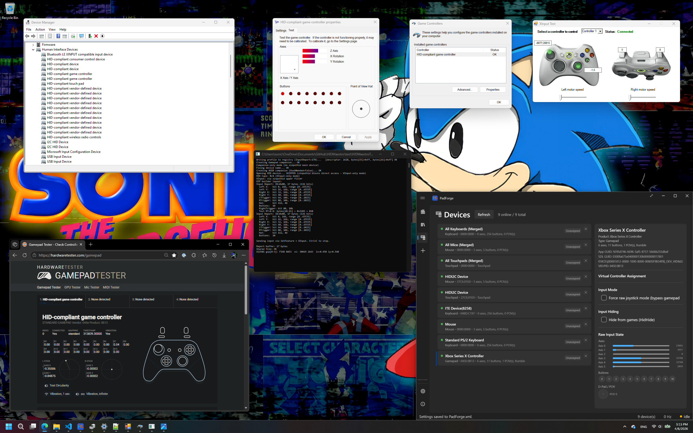
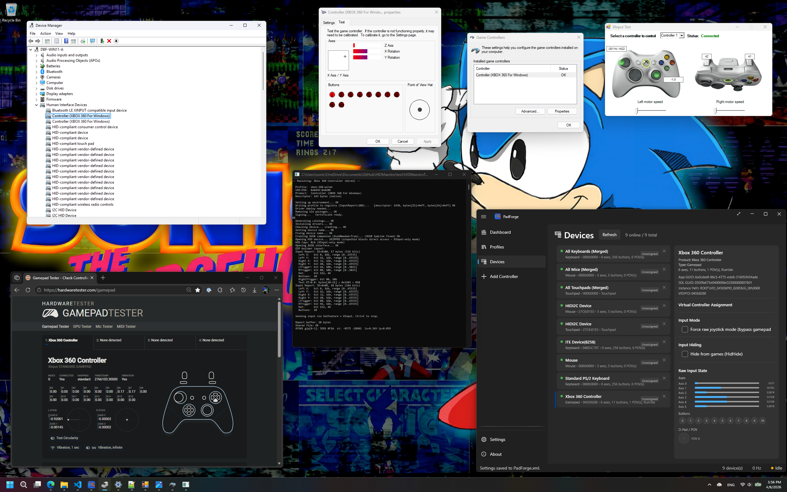
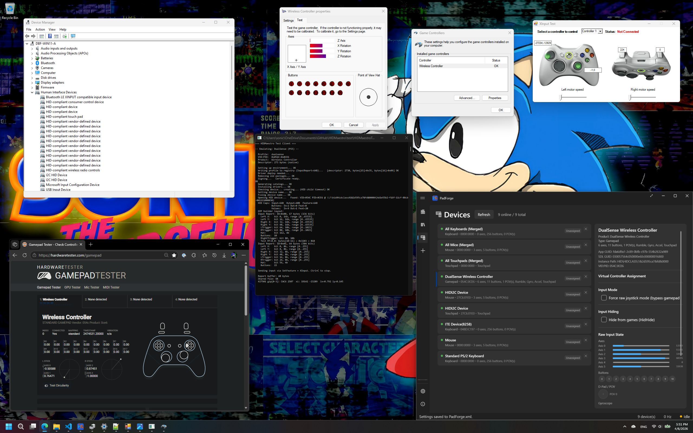

<p align="center">
  <picture>
    <source media="(prefers-color-scheme: dark)" srcset="docs/logo-light.png">
    <source media="(prefers-color-scheme: light)" srcset="docs/logo.png">
    
  </picture>
</p>

# HIDMaestro

*"And we talk of Christ, we rejoice in Christ, we preach of Christ, we prophesy of Christ, and we write according to our prophecies, that our children may know to what source they may look for a remission of their sins."* — 2 Nephi 25:26

*Glory, honor, and praise to the Lord Jesus Christ, the source of all truth, forever and ever.*

A user-mode virtual game controller platform that presents like real hardware across the Windows gaming input stack.

HIDMaestro creates profile-driven virtual controllers without a custom kernel driver, EV certificate, or reboot cycle. DirectInput, XInput, SDL3, browser Gamepad, and WGI/GameInput can all see the device identity and behavior the profile defines. The stack builds on the UMDF2 + xinputhid approach that [Nefarius](https://nefarius.at/) used in [DsHidMini](https://github.com/nefarius/DsHidMini).

## What it replaces

- **vJoy**: needs a kernel driver and is no longer actively maintained. The existing signed drivers work, but producing new builds requires driver signing infrastructure. Devices show up as "vJoy Device", not as a real controller.
- **ViGEmBus**: needs a kernel driver. Existing signed drivers work, but producing new builds requires an EV code signing certificate ($300+/year). The project is retired.
- **DsHidMini**: supports 5 HID modes (including DS4 and Xbox emulation) but requires a physical DualShock 3 connected. It translates real hardware, not arbitrary input sources.
- **VHF**: a Microsoft kernel framework. Kernel mode only.

HIDMaestro runs entirely in user mode. It works with locally generated self-signed certificates trusted by the target machine: no purchased certificate and no Windows test-signing boot mode required. It creates and removes controllers without rebooting. DirectInput, XInput, SDL3, and the Chrome Gamepad API see the identity and behavior the profile defines.

## Features

### No Kernel Driver
HIDMaestro uses UMDF2 (User-Mode Driver Framework). The driver runs in a regular Windows process, not the kernel. A bug in HIDMaestro cannot blue-screen the machine. No EV certificate, no WHQL. HIDMaestro works with locally generated self-signed certificates trusted by the target machine; no purchased certificate or `testsigning` boot mode is required.

### Exact Hardware Identity
Choose from 225 embedded profiles across 32 vendors (Xbox 360, Xbox Series X|S, DualSense, Thrustmaster wheels, Logitech HOTAS, flight sticks, racing pedals, fight sticks, and more), or extend support through data-driven JSON profiles. Profiles define the public-facing identity and report behavior; vendor-specific extras (LEDs, audio, sensors) may require per-device work. For the public-facing identity and report path defined by the profile, HIDMaestro sets the exact VID/PID, product string, HID descriptor, axis count, button count, trigger behavior, and bus type. SDL3's controller database matches it. Steam recognizes it. Chrome identifies it. joy.cpl shows the right name.

### Cross-API Coverage
Most solutions get one or two APIs right. HIDMaestro targets all of them simultaneously:

| API | What HIDMaestro Delivers |
|-----|-------------------------|
| **DirectInput** | Correct axes, buttons, POV, VID/PID |
| **XInput** | Separate triggers, proper button mapping, single slot |
| **SDL3/HIDAPI** | Correct identity, Bluetooth bus type when tested |
| **Browser Gamepad** | STANDARD GAMEPAD with separate triggers |
| **WGI (GameInput)** | Proper Gamepad promotion via GameInput registry |

### Multi-Controller
Multiple virtual controllers run simultaneously with no hard limit. Tested with 6 mixed (2x Xbox Series BT, 2x Xbox 360 Wired, 2x DualSense) with correct per-controller ordering across all APIs. XInput caps at 4 slots for Xbox-family profiles; non-Xbox profiles are visible through DInput/HIDAPI/WGI/RawInput/Browser without that limit.

### Hot-Plug
Create and remove controllers without reboots. Each controller is independently disposable: remove one while the others keep running, or switch profiles live within the same process. Single-controller creation takes ~200ms on a warm start; 6-controller mixed creation takes ~3.5s total.

### Profile-Based
Every controller is a JSON file: VID, PID, descriptor, trigger mode, connection type are all data-driven. Adding support for a new controller means writing a JSON file, not modifying code. The profiles directory ships 225 profiles across 32 vendors covering gamepads, racing wheels, HOTAS sticks, flight sticks, pedals, arcade sticks, and more.

### Custom Controllers: build or modify any device
Using the public `HidDescriptorBuilder`, `HMProfileBuilder`, and `HMDeviceExtractor` APIs, consumers can:

- **Clone and modify** an existing profile: e.g. take a DualSense (15 buttons) and create a variant with 16 buttons. Windows, Steam, and games still see "DualSense" because the VID/PID and product string are preserved, but the descriptor declares the extra button.
- **Build new controllers from scratch**: define a custom flight stick, racing wheel, or arcade panel with arbitrary VID/PID, product string, axis count, button count, and axis resolution. No hex editing, no descriptor knowledge required.
- **Spoof an arbitrary controller**: if you know a device's VID, PID, and product string, you can create a virtual copy even if it's not in the 225-profile catalog.
- **Capture a connected device**: `HMDeviceExtractor.Extract` reads the cached HID descriptor Windows parsed from any real HID device you have plugged in and returns a ready-to-deploy `HMProfile`. No JSON authoring, no descriptor reverse engineering — point it at the controller and you get a matching virtual.

The result is an SDK for fully custom virtual controllers that present as real hardware to every API simultaneously, with no kernel driver and no fixed "vJoy Device" identity.

```csharp
// Clone a DualSense and add a button
var custom = new HMProfileBuilder()
    .FromProfile(ctx.GetProfile("dualsense")!)
    .Id("dualsense-16btn")
    .Descriptor(new HidDescriptorBuilder()
        .Gamepad()
        .AddStick("Left", 8).AddStick("Right", 8)
        .AddTrigger("Left", 8).AddTrigger("Right", 8)
        .AddButtons(16).AddHat()
        .Build())
    .InputReportSize(8)
    .Build();
using var ctrl = ctx.CreateController(custom);

// Or build a flight stick from nothing
var stick = new HMProfileBuilder()
    .Id("my-stick").Name("My Flight Stick")
    .Vid(0x0483).Pid(0x0001)
    .ProductString("Custom HOTAS")
    .Descriptor(new HidDescriptorBuilder()
        .Joystick()
        .AddStick("Left", 16)
        .AddTrigger("Left", 8).AddTrigger("Right", 8)
        .AddButtons(12).AddHat()
        .Build())
    .InputReportSize(8)
    .Build();
using var ctrl2 = ctx.CreateController(stick);

// Or capture a physical controller and deploy as a virtual
var device = HMDeviceExtractor.ListDevices()
    .First(d => d.VendorId == 0x046D && d.ProductId == 0xC216);
var extracted = HMDeviceExtractor.Extract(device);
using var ctrl3 = ctx.CreateController(extracted);
// Virtual now presents with the real device's descriptor, VID/PID,
// product string — identical to what the physical device reports.
```

### Profile Extractor (GUI tool)

Every HIDMaestro release ships a standalone WPF app (`HIDMaestroProfileExtractor.exe`) under `HIDMaestroProfileExtractor/` in the release ZIP. It calls the same `HMDeviceExtractor` API from a dropdown-and-save UI:

1. Plug any HID device into Windows.
2. Run `HIDMaestroProfileExtractor.exe` (no admin required).
3. Pick the device from the dropdown, click **Extract**.
4. Save the Profile JSON to disk or copy it to the clipboard.

The output is the exact JSON format shipped in `profiles/<vendor>/<slug>.json`. Drop it in a PR (or an [issue via the profile contribution template](https://github.com/hifihedgehog/HIDMaestro/issues/new?template=profile-contribution.yml)) to add the profile to the catalog so every HIDMaestro user can emulate that controller without owning it themselves.

The extractor reads only the cached HID descriptor Windows has already parsed — no live input capture, no gameplay involvement. Reconstruction uses a C# port of the libusb/hidapi algorithm (Chromium WebHID team's reverse engineering of Microsoft's preparsed-data layout). Output is logically equivalent to the device's real HID report descriptor: same report IDs, field layouts, logical ranges, usage pages, and sizes.

## Techniques

A few HIDMaestro techniques that are not well documented elsewhere in the virtual controller space.

### Velocity Usage Descriptor Trick

Real Xbox 360 controllers have a combined trigger axis (Z) in DirectInput: both triggers share one axis. Browsers and WGI need separate trigger values. Previous solutions had to choose: correct DI (5 axes, combined) or correct browser (separate triggers, 6 axes).

HIDMaestro uses HID velocity usages (Vx and Vy, Usage Page 0x01, Usages 0x40/0x41) to carry separate trigger values in the same HID report. DirectInput does not map velocity usages to any axis slot, so it sees 5 axes. GameInput/WGI enumerates them as additional axes and reads separate trigger data via the GameInput registry mapping.

Result: 5 axes and 10 buttons in DirectInput (matching real xusb22.sys), separate triggers in the browser (matching real XInput), all from one HID descriptor.

### BTHLEDEVICE Bus Type Spoofing

HIDAPI detects Bluetooth controllers by checking for `BTHLEDEVICE` in the device's CompatibleIDs. HIDMaestro sets this property from user mode during device creation, without Bluetooth hardware and without a kernel bus driver.

SDL3 then uses its Bluetooth-specific controller parsing path, which handles the descriptor correctly. Without this spoof, SDL3's default parser produces zeros for certain virtual device configurations.

### &IG_ Enumerator Trick

By using `VID_*&PID_*&IG_00` as the device enumerator, the HID child's device path contains `&IG_`. This has three simultaneous effects:

- **Chrome RawInput** skips it (prevents duplicate gamepad entries)
- **HIDAPI** skips it (by design for XInput-handled devices)
- **SDL3** still detects it (falls through to RawInput backend, maps by VID/PID)

One string in a device path controls three different detection paths across three different libraries.

### GameInput Registry Override

Windows has a built-in GameInput mapping database for known VID/PIDs. HIDMaestro writes custom mappings that point the trigger axes to the velocity usage indices (5 and 6 instead of the default combined axis 4). This makes WGI's Gamepad object read actual separate trigger values from the Vx/Vy fields.

## Comparison

| Feature | HIDMaestro | ViGEmBus | DsHidMini | vJoy |
|---------|-----------|----------|-----------|------|
| Kernel driver required | **No** | Yes | No (UMDF2) | Yes |
| EV certificate for new builds | **No** | Yes | No | Yes |
| Physical hardware required | **No** | No | Yes (DS3) | No |
| Profile-defined controller identity | **Yes** | No (2 types) | Yes (5 modes) | No (fixed) |
| Bluetooth bus type spoof | **Yes** | No | No | No |
| Single browser gamepad entry | **Yes** | Yes | N/A | No |
| XInput with separate triggers | **Yes** | Yes | Yes | No |
| DirectInput with correct axes | **Yes** | Yes | Yes | Partial |
| SDL3 with correct identity | **Yes** | Yes | Yes (real HW) | No |
| Hot-plug without reboot | **Yes** | Yes | N/A | No |
| Data-driven profiles | **Yes** | No | No | No |
| Custom descriptor builder | **Yes** | No | No | Yes (fixed layout) |
| Clone + modify existing profiles | **Yes** | No | No | No |
| Spoof arbitrary VID/PID | **Yes** | No | No | No |
| Status | **Active** | Retired | Active | Stale |

## Architecture

```
User-Mode Test App
  │ Writes input data to per-controller shared memory section
  │ Manages device lifecycle (create, configure, remove)
  │
  ├──► Shared Memory (per-controller)
  │     SeqNo(4) + HID Report(64) + GIP Data(14) = 86 bytes
  │     Event-driven: SDK signals InputDataEvent on each write
  │
  ├──► Main HID Device (HIDMaestro.dll via mshidumdf)
  │     ROOT\VID_045E&PID_028E&IG_00\0000
  │     ├─ HID descriptor with Vx/Vy velocity triggers
  │     ├─ Event-driven worker reads shared memory → HID READ_REPORT
  │     │   (seqno-gated: idle CPU cost ~0.04% per controller)
  │     ├─ USB + WinExInput interfaces
  │     └─ BTHLEDEVICE CompatibleIDs (Bluetooth profiles)
  │
  └──► XUSB Companion (HMXInput.dll, XnaComposite class)
        ROOT\HMCompanion\0000  (non-xinputhid Xbox profiles only)
        ├─ XUSB interface → XInput discovery
        ├─ WinExInput interface → WGI GamepadAdded
        ├─ Event-driven: reads GipData from shared memory
        └─ Handles GET_STATE/GET_CAPABILITIES/SET_STATE IOCTLs
```

**Data flows:**
- **DirectInput** ← HID READ_REPORT ← shared memory (combined Z + Vx/Vy in descriptor)
- **XInput** ← XUSB GET_STATE ← companion reads GipData from shared memory
- **SDL3** ← HIDAPI skips (&IG_) → RawInput fallback → maps by VID/PID
- **Browser** ← WGI Gamepad ← GameInput reads Vx/Vy via registry mapping
- **Bluetooth ID**: HIDAPI checks CompatibleIDs, reports bus_type=BT

## Getting Started

Requirements: Visual Studio 2022+, Windows SDK/WDK 10.0.26100.0, .NET 10

```bash
# Smallest possible SDK consumer (drop-in quickstart)
dotnet run --project example\SdkDemo

# Full test app (self-contained: cert + build + sign + install all automatic)
cd test
dotnet build -c Debug
bin\Debug\net10.0-windows10.0.26100.0\win-x64\HIDMaestroTest.exe emulate xbox-360-wired

# Multiple controllers at once (up to 6 verified, any mix of profiles)
HIDMaestroTest.exe emulate xbox-series-xs-bt xbox-series-xs-bt xbox-360-wired dualsense

# Interactive commands during emulation:
#   remove 2              dispose controller 2 (others stay live)
#   2 dualsense           live-swap controller 2 to a DualSense
#   mark / unmark         toggle static-button diagnostic mode
#   pause / resume        idle CPU test (driver should use ~0%)
#   quit                  graceful shutdown

# List available profiles (225 across 32 vendors)
HIDMaestroTest.exe list

# Search profiles
HIDMaestroTest.exe search thrustmaster

# Validate all APIs (XInput, DirectInput, HIDAPI/SDL3, browser, WGI, HID order)
python scripts\verify.py --controllers 4

# Cross-API ordering diagnostic with correct open-then-trigger semantics
build\multipad_check.exe --trigger --expected 4
```

The test app is fully self-contained. On first run it:
1. Creates a locally trusted self-signed certificate (if needed)
2. Extracts pre-built driver DLLs from the SDK assembly
3. Signs everything
4. Installs driver packages
5. Creates the virtual controller(s)
6. Starts feeding test input data (time-varying pattern by default)

No external scripts, no manual setup, no popups. Just the one console window. Requires elevation (administrator privileges).

## Profile System

Controller profiles are JSON files in `profiles/`:

```json
{
  "id": "xbox-360-wired",
  "name": "Xbox 360 Controller (Wired)",
  "vid": "0x045E",
  "pid": "0x028E",
  "productString": "Controller (XBOX 360 For Windows)",
  "descriptor": "05010905a101a100093009311500...",
  "inputReportSize": 18,
  "triggerMode": "combined",
  "connection": "usb"
}
```

The descriptor field contains the raw HID report descriptor as hex. The test app parses it, builds input reports, and feeds data through shared memory. Adding a new controller is a matter of capturing its descriptor and writing a JSON file.

## Validation Results

Tested on Windows 11 IoT Enterprise LTSC 2024 (build 26200) with a locally generated self-signed certificate added to the machine's Root and TrustedPublisher stores (no `bcdedit /set testsigning` required). Each profile was deployed via the test app and validated with `scripts/verify.py` plus manual verification in joy.cpl, PadForge/SDL3, Chrome Gamepad API, and XInput state readers.

Multi-controller verified with 6 simultaneous mixed controllers (2x Xbox Series BT + 2x Xbox 360 Wired + 2x DualSense): all 6 APIs report correct per-controller identity and ordering. Real Microsoft Xbox Series X|S BT controller tested side-by-side: virtual and real exhibit byte-identical behavior across all HID class APIs.

### Summary

| Profile | DirectInput | XInput | SDL3 | Browser | WGI |
|---------|------------|--------|------|---------|-----|
| Xbox 360 Wired | 5 axes, 10 btns | 1 slot, separate triggers | &IG_ path, USB | STANDARD GAMEPAD, separate | 1 interface |
| Xbox Series BT | 5 axes, 16 btns | 1 slot, separate triggers | &IG_ path, Bluetooth | STANDARD GAMEPAD, separate | 1+ interfaces |
| DualSense (PS5) | 6 axes, 15 btns | N/A | USB | Detected | N/A |
| **6-controller mixed** | **All 6 visible** | **4 slots (XInput cap)** | **4 IG + 2 live** | **4 pads (Chromium cap)** | **All 6 visible** |

### Xbox 360 Controller (Wired)

| Check | Result |
|-------|--------|
| DirectInput axes | 5 (X, Y, Rx, Ry, Z combined) |
| DirectInput buttons | 10 |
| DirectInput VID:PID | 045E:028E |
| XInput slots | 1 |
| XInput triggers | Separate (LT and RT independent) |
| SDL3/HIDAPI | Detected via XInput, &IG_ path |
| Browser Gamepad | "Xbox 360 Controller (XInput STANDARD GAMEPAD)" |
| Browser triggers | Separate (via Vx/Vy + GameInput mapping) |
| WGI/WinExInput | 1 enabled interface |
| Duplicates | None |

### Xbox Series X|S Controller (Bluetooth)

| Check | Result |
|-------|--------|
| DirectInput axes | 5 |
| DirectInput buttons | 16 (Win11 xinputhid standard) |
| DirectInput VID:PID | 045E:0B13 |
| XInput slots | 1 |
| XInput triggers | Separate |
| SDL3/HIDAPI | bus_type = Bluetooth |
| BTHLEDEVICE spoof | Confirmed (HIDAPI bus_type=2) |
| Browser Gamepad | Detected, separate triggers |
| WGI/WinExInput | 1+ enabled interfaces |
| Duplicates | None |

### Screenshots

**Xbox Series X|S Bluetooth** in Device Manager, joy.cpl, Chrome Gamepad Tester, PadForge/SDL3:


**Xbox 360 Wired** in Device Manager, joy.cpl, Chrome Gamepad Tester, PadForge/SDL3:


**DualSense (PS5)** in Device Manager, joy.cpl, Chrome Gamepad Tester, PadForge/SDL3:


### Tool Output Logs

<details>
<summary>HIDAPI enumeration: Xbox 360 Wired (click to expand)</summary>

```
VID=0x045E PID=0x028E
  Product: Controller (XBOX 360 For Windows)
  Usage: page=0x0001 usage=0x0005
  Bus type: 1 (USB)
  Path: \\?\HID#VID_045E&PID_028E&IG_00#...
  &IG_ in path: True
```
</details>

<details>
<summary>HIDAPI enumeration: Xbox Series BT (click to expand)</summary>

```
VID=0x045E PID=0x0B13
  Product: HID-compliant game controller
  Bus type: 2 (Bluetooth)
  &IG_ in path: True
```
</details>

<details>
<summary>XInput state: Xbox 360 Wired (click to expand)</summary>

```
Slot 0: Connected  LT=87 RT=87 LX=3080 LY=29988 Buttons=0x1000
Slot 1: Not connected
Slot 2: Not connected
Slot 3: Not connected
```
</details>

<details>
<summary>PnP device tree: Xbox 360 Wired (click to expand)</summary>

```
Status Class        FriendlyName                  InstanceId
------ -----        ------------                  ----------
OK     HIDClass     Game Controller               ROOT\VID_045E&PID_028E&IG_00\0000
OK     XnaComposite HIDMaestro XInput Companion   ROOT\HMCOMPANION\0000
OK     HIDClass     HID-compliant game controller HID\VID_045E&PID_028E&IG_00\...
```
</details>

<details>
<summary>XUSB + WinExInput interfaces (click to expand)</summary>

```
XUSB Interface:
  Path:   \\?\ROOT#HMCOMPANION#0000#{ec87f1e3-c13b-4100-b5f7-8b84d54260cb}
  Device: ROOT\HMCOMPANION\0000
  Status: Enabled

WinExInput Interface:
  Path:   \\?\ROOT#HMCOMPANION#0000#{6c53d5fd-6480-440f-b618-476750c5e1a6}\XI_00
  Device: ROOT\HMCOMPANION\0000
  Status: Enabled
```
</details>

### Startup and Hot-Plug Timing

| Operation | Measured Time |
|-----------|--------------|
| Cold start (first run: cert + sign + install + create 1) | ~18s |
| Warm start, single controller (drivers cached) | **~200ms** |
| Warm start, 6 mixed controllers (sequential) | **~3.5s** |
| Single dispose: plain HID (DualSense, wheels, etc.) | **~200ms** |
| Single dispose: Xbox 360 Wired (XUSB companion) | ~5.6s |
| Single dispose: Xbox Series BT (xinputhid filter) | ~11s |
| 6-controller mixed cleanup (sequential) | ~33s (dominated by Xbox teardown) |

Cold start includes certificate creation, signing, catalog generation, driver package installation, and device creation. This only happens on first run or after SDK updates. Warm start uses event-driven polled waits that exit as soon as PnP is ready. Zero fixed `Thread.Sleep` calls remain in any creation, cleanup, or finalization path. Controllers are independently disposable: removing one does not disturb the others.

### Profile Architecture Groups and Teardown Timing

Disposal speed depends on which kernel-side drivers are in the device stack. Each additional driver in the stack adds its own PnP query-remove handshake, handle release, and notification cascade. HIDMaestro profiles fall into three architecture groups with dramatically different teardown characteristics:

#### 1. Plain HID: generic gamepads, wheels, HOTAS, flight sticks (~200ms)

Profiles where `driverMode` is not `"xinputhid"` and the VID is not Microsoft (`0x045E`). Includes DualSense, DualShock 4, all Logitech wheels, Thrustmaster HOTAS, flight sticks, pedals, arcade sticks, and most of the 225-profile catalog.

```
ROOT\VID_054C&PID_0CE6\NNNN          ← our UMDF2 driver (mshidumdf host)
  └─ HID\VID_054C&PID_0CE6\...       ← raw HID PDO, no upper filter
```

**Lightest stack.** One `DIF_REMOVE` on the ROOT parent tears down the entire tree. No XUSB companion device, no Microsoft upper filter. Creation ~200ms, disposal ~200ms.

#### 2. Non-xinputhid Xbox: Xbox 360 Wired (~5.7s)

Xbox-VID profiles (`0x045E`) where xinputhid is not in the path. XInput is delivered via a separate HMCOMPANION device running `HMXInput.dll` (XUSB companion).

```
ROOT\VID_045E&PID_028E&IG_00\NNNN    ← our UMDF2 driver (main HID device)
  └─ HID\VID_045E&PID_028E&IG_00\... ← HID child (raw PDO, input.inf)
ROOT\HMCOMPANION\NNNN                ← XUSB companion (HMXInput.dll)
  ├─ XUSB interface → XInput slot
  └─ WinExInput interface → WGI
```

**Medium stack.** Three devices to tear down. The XUSB companion runs its own WUDFHost instance hosting `HMXInput.dll`, which needs its own PnP release cycle. Creation ~700ms, disposal ~5.7s.

#### 3. xinputhid Xbox: Xbox Series X|S Bluetooth (~11s)

Profiles with `driverMode: "xinputhid"`. These match `xinputhid.inf [GIP_Hid]` by hardware ID (`HID\VID_045E&PID_0B13&IG_00`), which binds Microsoft's `xinputhid.sys` as an upper filter on the HID child. xinputhid provides XInput delivery + 16-button descriptor synthesis natively: no XUSB companion needed, single Device Manager entry.

```
ROOT\VID_045E&PID_0B13&IG_00\NNNN    ← our UMDF2 driver (mshidumdf host)
  └─ HID\VID_045E&PID_0B13&IG_00\... ← HID child (xinputhid.inf, xinputhid upper filter)
        ├─ xinputhid.sys              ← Microsoft inbox kernel filter
        ├─ XInput delivery (internal)
        └─ 16-button HID synthesis
```

**Heaviest stack.** xinputhid is a Microsoft inbox kernel filter driver. Its teardown goes through the full PnP query-remove → class installer → filter unload chain. This is entirely controlled by Microsoft's driver; HIDMaestro cannot speed it up. Creation ~200ms, disposal ~11s.

#### Why this matters for consumers

If your application needs fast profile switching (e.g. remapping a physical controller to a different virtual identity on the fly), the profile architecture group determines the user-perceived latency:

- **Switching between plain HID profiles** (DualSense ↔ DualShock 4, or any non-Xbox pair): ~400ms round trip (200ms dispose + 200ms create). Essentially instant.
- **Switching to/from Xbox 360 Wired**: ~6-7s (XUSB companion teardown dominates).
- **Switching to/from Xbox Series BT**: ~11-12s (xinputhid teardown dominates).

## Why UMDF2 Is Enough

A common assumption is that virtual game controllers require kernel-mode drivers. Here's why UMDF2 works:

- **HID class driver is already in the kernel.** Windows ships `mshidumdf.sys` which acts as a kernel-mode HID minidriver proxy. Our UMDF2 DLL runs in user mode but the HID class stack sees a real HID device.
- **XInput discovery uses device interfaces, not bus type.** `xinput1_4.dll` finds controllers through the XUSB device interface GUID. A UMDF2 driver can register this interface from user mode.
- **GameInput reads HID reports, not driver internals.** WGI/GameInput reads from the HID preparsed data and report descriptors; it does not care whether the underlying driver is kernel or user mode.
- **SDL3 and HIDAPI check device paths and attributes.** Bus type, VID/PID, and device path strings are all settable from user mode via SetupDI and CM APIs.

The only things UMDF2 *cannot* do: create PDOs (Physical Device Objects) as children of a bus, or intercept internal kernel IOCTLs. HIDMaestro works around this by using a companion device for XUSB and root-enumerated device nodes for the HID stack.

## Known Limitations

- **Output passthrough is delivered but not routed to hardware.** The driver accepts rumble/haptics/FFB SET_STATE IOCTLs and the SDK raises `HMController.OutputReceived` events to the consumer application. Routing those events to a physical controller is the consumer's responsibility (e.g. PadForge handles this).
- **Auth-chip controllers.** Some platforms (PS4/PS5 online, Nintendo Switch Online) require cryptographic authentication from the controller hardware. HIDMaestro cannot replicate authentication chips.
- **Vendor-specific feature reports.** Some controllers use proprietary feature reports for calibration, LED control, or firmware updates. HIDMaestro profiles currently cover standard input/output; vendor extensions require per-controller work.
- **XUSB companion creates a second device node** for non-xinputhid Xbox profiles (e.g. Xbox 360 Wired). Real Xbox controllers have XUSB and HID on the same PDO. HIDMaestro uses a separate companion device because mshidumdf suppresses XUSB IOCTLs. This is invisible to applications but visible in Device Manager. Xbox Series BT profiles use xinputhid natively and do not need a companion.
- **HID class APIs are event-driven, not state-driven.** DirectInput, HIDAPI, WGI, and RawInput only see state changes that occur after a consumer opens the device. Buttons held *before* a consumer opens are invisible until released and re-pressed. This is standard Windows HID class behavior, not a HIDMaestro limitation. Tested and confirmed: a real Microsoft Xbox Series X|S BT controller exhibits byte-identical behavior (holding A before opening joy.cpl shows A as not pressed). XInput is the exception (always-on, polled by the OS).
## How to Reproduce the Validation

Each validation result above was produced with these tools:

| Check | Tool | Command / Method |
|-------|------|-----------------|
| DirectInput axes/buttons | Python `ctypes` + DirectInput8 + `winmm.joyGetDevCapsW` | `scripts/verify.py` |
| XInput slots/triggers | Python `ctypes` + `xinput1_4.XInputGetState` | `scripts/verify.py` |
| SDL3/HIDAPI identity | Python `hid.enumerate()` | `scripts/verify.py` |
| Browser Gamepad | Headless Edge/Chrome → `navigator.getGamepads()` | `scripts/verify.py` (via `scripts/browser_check/`) |
| GameInput / WGI | `winrt.windows.gaming.input.RawGameController` | `scripts/verify.py` |
| HID enumeration order | Python `hid.enumerate()` filtered by `HM-CTL-` serial | `scripts/verify.py` |
| Cross-API mark-mode ordering | C++ multi-backend harness (MPT 1:1) | `build/multipad_check.exe --trigger` |
| Real vs virtual HID stream diff | C++ HID capture tool | `build/hid_capture.exe <vid> <pid>` |
| Device tree | `Get-PnpDevice` (PowerShell) | Manual |
| joy.cpl | Windows Game Controllers control panel | Manual |

To reproduce: run `HIDMaestroTest.exe emulate <profile-id>`, then run `python scripts/verify.py` in a separate terminal. For multi-controller validation: `HIDMaestroTest.exe emulate <id1> <id2> ...` then `python scripts/verify.py --controllers N`.

## Glossary

| Term | Meaning |
|------|---------|
| **XUSB** | Xbox USB protocol. The device interface GUID (`{EC87F1E3-...}`) that `xinput1_4.dll` discovers to find Xbox controllers. |
| **WinExInput** | Windows Extended Input. A device interface GUID (`{6C53D5FD-...}`) that WGI uses to fire `GamepadAdded` events for browser detection. |
| **XUSB Companion** | A separate UMDF2 device (`HMXInput.dll`) that handles XUSB IOCTLs for XInput. Needed because `mshidumdf` suppresses XUSB on HID devices. |
| **GameInput mapping** | Registry entries at `HKLM\...\GameInput\Devices\{VID}{PID}...` that tell WGI how to map HID axes/buttons to the Gamepad interface. |
| **&IG_** | "Interface Group" marker in Xbox device paths. Chrome and HIDAPI skip devices with this in the path; SDL3 falls through to its RawInput backend. |
| **Vx/Vy** | HID velocity usages (0x40/0x41). Invisible to DirectInput's axis mapper but enumerated by GameInput; used to carry separate trigger values. |
| **mshidumdf** | Microsoft's kernel-mode HID minidriver proxy that hosts UMDF2 HID drivers. |

## Security and Scope

HIDMaestro replicates the public-facing identity and input/output behavior of game controllers. It does **not**:

- Replicate cryptographic authentication (PS4/PS5 auth chips, Nintendo Switch pairing)
- Implement vendor-private protocols unless explicitly added to a profile
- Bypass anti-cheat systems (virtual devices are detectable by kernel-level anti-cheat)
- Modify or intercept data from physical controllers

## Credits

- **[DsHidMini](https://github.com/nefarius/DsHidMini)** by [Nefarius Software Solutions](https://nefarius.at/). HIDMaestro builds on the UMDF2 + xinputhid approach that Nefarius used in DsHidMini. DsHidMini demonstrated that a user-mode driver framework can replace kernel-mode drivers for game controller emulation on Windows. The same architecture (`mshidumdf` as the kernel-side HID proxy, `WUDFRd` as the reflector, xinputhid as the XInput bridge) is the foundation HIDMaestro's virtual controller stack is built on.
- **[HIDAPI](https://github.com/libusb/hidapi)**: bus type detection behavior informed the BTHLEDEVICE spoofing technique.
- **[SDL3](https://github.com/libsdl-org/SDL)**: multi-backend fallback behavior informed the &IG_ enumerator trick. SDL3 is not a dependency; HIDMaestro is validated against it.

## Donations

Knowing HIDMaestro is useful is reward enough. If you truly insist on donating, please donate to your charity of choice and bless humanity. If you can't think of one, consider [Humanitarian Services of The Church of Jesus Christ of Latter-day Saints](https://philanthropies.churchofjesuschrist.org/humanitarian-services). Also consider donating directly to the upstream projects listed above; they made all of this possible.

**My promise:** HIDMaestro will never become paid, freemium, or Patreon early-access paywalled. Free means free.

## License

MIT License. See [LICENSE](LICENSE) for details.
