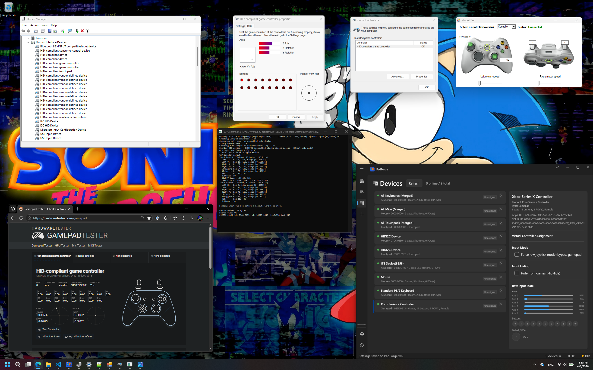
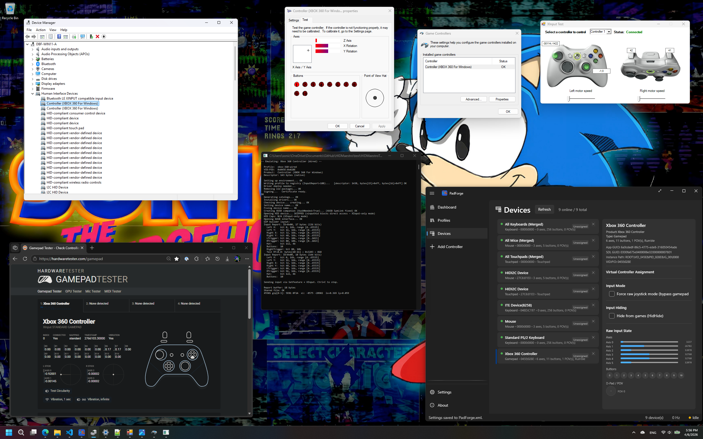
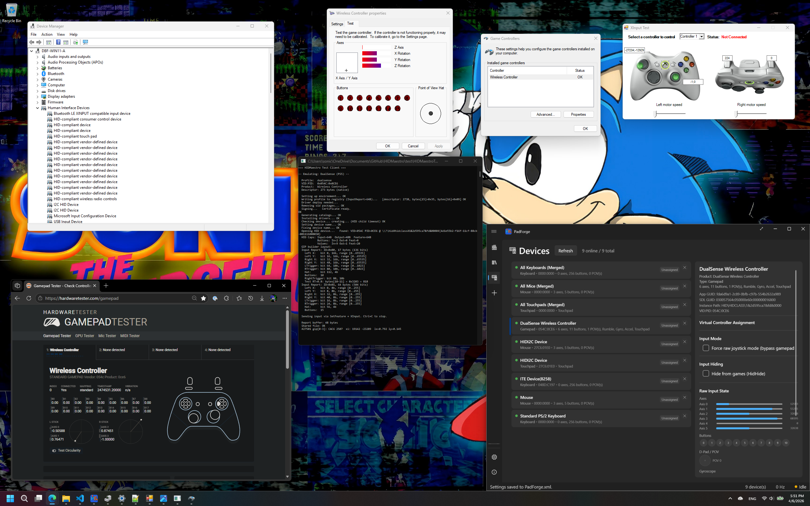
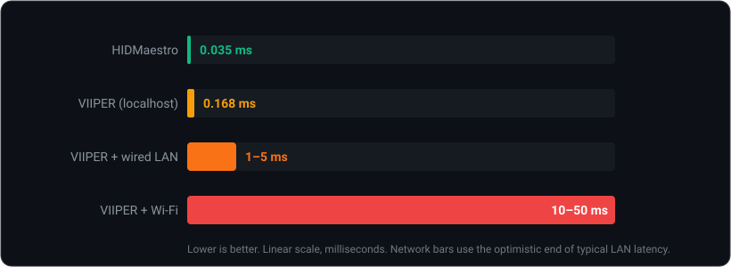

<p align="center">
  <picture>
    <source media="(prefers-color-scheme: dark)" srcset="docs/logo-light.png">
    <source media="(prefers-color-scheme: light)" srcset="docs/logo.png">
    
  </picture>
</p>

<h1 align="center">HIDMaestro</h1>

*"And we talk of Christ, we rejoice in Christ, we preach of Christ, we prophesy of Christ, and we write according to our prophecies, that our children may know to what source they may look for a remission of their sins."* — 2 Nephi 25:26

*Glory, honor, and praise to the Lord Jesus Christ, the source of all truth, forever and ever.*

---

<p align="center">
  <a href="https://somsubhra.github.io/github-release-stats/?username=hifihedgehog&repository=HIDMaestro"></a>
  <a href="https://discord.gg/qawTZHVhNH"></a>
  <a href="https://hidmaestro.org/"></a>
  <a href="https://hidmaestro.org/docs/"></a>
  <a href="https://github.com/hifihedgehog"></a>
  <a href="https://x.com/hifihedgehog"></a>
</p>

**Virtual game controllers that look like real hardware to Windows. No kernel driver. No network. No reboot.**

HIDMaestro creates virtual controllers that present the exact identity of real hardware across the whole Windows input stack at once. Pick from 228 built-in profiles or point it at a controller you own and clone it. DirectInput, XInput, SDL3, the browser Gamepad API, and WGI/GameInput all see the VID/PID, product name, HID descriptor, axis and button layout, and bus type the profile defines.

It runs entirely in user mode (UMDF2), signed with a locally trusted self-signed certificate. No EV certificate, no `testsigning` boot mode, no kernel driver that can blue-screen the machine.

<p align="center"><b>228</b> device profiles · <b>32</b> vendors · <b>~35 µs</b> median single-press · <b>0</b> kernel drivers</p>

```csharp
using var ctx = new HMContext();
ctx.LoadDefaultProfiles();
ctx.InstallDriver();
using var ctrl = ctx.CreateController(ctx.GetProfile("xbox-360-wired")!);
ctrl.SubmitState(new HMGamepadState { Buttons = HMButton.A });
```

---

## Quick start

Requirements: Visual Studio 2022+, Windows SDK/WDK 10.0.26100.0, .NET 10.

```bash
# Build the native driver + companion + SDK together (idempotent).
scripts\build_all.cmd

# Minimal SDK consumer
dotnet run --project example\SdkDemo

# Full test app: cert + build + sign + install all automatic, requires elevation
cd test
dotnet build
bin\Release\net10.0-windows10.0.26100.0\win-x64\HIDMaestroTest.exe emulate xbox-360-wired

# Several controllers at once, any mix of profiles
HIDMaestroTest.exe emulate xbox-series-xs-bt xbox-360-wired dualsense

# List or search the 228 profiles
HIDMaestroTest.exe list
HIDMaestroTest.exe search thrustmaster

# Measure input latency
HIDMaestroTest.exe latency xbox-360-wired

# Validate every API (XInput, DirectInput, HIDAPI/SDL3, browser, WGI, HID order)
python scripts\verify.py --controllers 4
```

The test app is self-contained. First run creates a locally trusted certificate, extracts and signs the driver, installs it, creates the controllers, and starts feeding a test pattern. One console window, no popups, requires administrator.

During emulation you can `remove 2` to dispose one controller, `2 dualsense` to live-swap controller 2, or `quit` to shut down cleanly.

If you want to use HIDMaestro through a UI instead of code, install [PadForge](https://padforge.org/). It wraps this SDK with a full input-mapping app.

---

## Identity: exact hardware, down to the bus.

VID/PID, product string, descriptor, axis and button layout, and bus type all match the real device. A Bluetooth controller reports as Bluetooth, not as a USB device wearing its name.

- **Exact hardware identity.** VID/PID, product string, HID descriptor, axis and button counts, trigger behavior, and bus type all come from the profile. SDL3's controller database matches it, Steam recognizes it, Chrome identifies it, joy.cpl shows the right name. A Bluetooth controller reports as Bluetooth, not as a USB device wearing its name.
- **Devices are JSON, not hardcoded.** Add a controller by writing a data-only JSON profile or by capturing one you already own. No per-device source code, no recompile, no hardcoded device classes.
- **Data-driven profiles.** Every controller is a JSON file. Adding support for a new one means writing JSON, not modifying code.
- **Sony pads answer the calibration read.** A game with native PlayStation support does not just read buttons from a DualSense, it reads the motion calibration report and builds a sensitivity from it. Serve zeros there and the divisor is zero, so the consumer gets NaN or rejects the controller outright, which is why a virtual pad can work in Steam Input and still be refused by the game. HIDMaestro serves the real non-degenerate calibration on both the UMDF2 and composite backends, byte-identical between them, with the field offsets checked against the Linux `hid-playstation` driver.
- **Where hardware revisions disagree, the current one wins.** A DualSense made in 2020 reports the product string `Wireless Controller`. A DualSense made today reports `DualSense Wireless Controller`. Both report `bcdDevice` 0x0100, so nothing on the wire distinguishes them and a profile can only serve one. As of v1.4.5 `dualsense` and `dualsense-composite` serve the current string, because a consumer keyed to the launch string is already broken against real modern hardware. The launch string stays reachable on `dualsense-bt`, whose `dualsense-bt-full` sibling carries the current one.
- **Protocol controllers, not just passive HID.** The Nintendo Switch Pro Controller is not a passive device: hosts drive a Nintendo subcommand handshake and stall without a device that answers. HIDMaestro's driver answers it over the real Bluetooth wire (the shipped descriptor is extracted byte-exact from a live Pro's SDP cache): SPI calibration reads, input-mode switch, 60 Hz full-mode streaming with gyro and accel at the 49-byte Bluetooth report size. SDL3's HIDAPI driver and Steam Input bind it as a real Bluetooth Pro Controller with motion and rumble. Before any protocol host arrives, the pad streams genuine 12-byte 0x3F simple-mode frames, the one report DirectInput can parse, so joy.cpl reads a working controller in exactly the states real hardware allows.

### Custom controllers

The `HidDescriptorBuilder`, `HMProfileBuilder`, and `HMDeviceExtractor` APIs let you build or modify any device:

- **Clone and modify.** Take a DualSense (15 buttons) and ship a 16-button variant. Windows, Steam, and games still see "DualSense" because the VID/PID and product string are preserved.
- **Build from scratch.** Define a flight stick, racing wheel, or arcade panel with arbitrary VID/PID, axis count, button count, and resolution. No hex editing.
- **Capture a real device.** `HMDeviceExtractor.Extract` reads the HID descriptor Windows parsed from any device you have plugged in and returns a ready-to-deploy profile. Point it at the controller, get a matching virtual.

```csharp
// Clone a DualSense and add a button
var custom = new HMProfileBuilder()
    .FromProfile(ctx.GetProfile("dualsense")!)
    .Id("dualsense-16btn")
    .Descriptor(new HidDescriptorBuilder()
        .Gamepad()
        .AddStick("Left", 8).AddStick("Right", 8)
        .AddTrigger("Left", 8).AddTrigger("Right", 8)
        .AddButtons(16).AddHat()
        .Build())
    .InputReportSize(9)
    .Build();
using var ctrl = ctx.CreateController(custom);
```

Adding a controller to HIDMaestro is a data change. Adding one to a code-per-device emulator means writing and compiling a new device implementation. That difference is the whole point of the profile system.

---

## Every API at once.

DirectInput, XInput, SDL3, the browser Gamepad API, and WGI/GameInput all see one correct device.

- **One device, every API.** DirectInput sees correct axes and buttons. XInput sees separate triggers in one slot. SDL3/HIDAPI sees the right identity and bus type. The browser sees a STANDARD GAMEPAD with separate triggers. WGI sees one Gamepad. [How this works](docs/INTERNALS.md#techniques).
- **Multiple controllers at once.** No hard limit. Verified with 6 mixed controllers, correct per-controller ordering across all APIs. XInput caps Xbox-family profiles at its own 4 slots.
- **Force feedback.** HID PID 1.0 answers for DirectInput FFB games, plus rumble/haptic output events the consumer routes to real hardware.
- **Hot-plug.** Create and remove controllers with no reboot. Live-swap a controller's profile mid-session. Warm single-controller create is ~200 ms.
- **Validated across every API and both ends of the spectrum.** A 41-scenario regression battery checks DirectInput, XInput, SDL3/HIDAPI, the browser Gamepad API, and WGI on every change, and passes on both a 16-core Windows 11 desktop and a low-power Intel Atom Windows 10 fixture.

### Validation

Tested on Windows 11 IoT Enterprise LTSC 2024 (build 26200) and Windows 10 IoT Enterprise LTSC (build 19044), with a self-signed certificate in the machine's Root and TrustedPublisher stores and no test-signing boot mode. Every profile is checked across all the input APIs a game can reach: DirectInput (joy.cpl and DirectInput8), XInput, SDL3/HIDAPI, the Chrome Gamepad API, WGI/GameInput, and HID enumeration order, through `scripts/verify.py` plus manual verification. A real Xbox Series X|S Bluetooth controller tested side by side shows byte-identical behavior across the HID class APIs.

| Profile | DirectInput | XInput | SDL3 | Browser | WGI |
|--|--|--|--|--|--|
| Xbox 360 Wired | 5 axes, 10 btns | 1 slot, separate triggers | &IG_ path, USB | STANDARD GAMEPAD | 1 entry |
| Xbox Series BT | 5 axes, 16 btns | 1 slot, separate triggers | &IG_ path, Bluetooth | STANDARD GAMEPAD | 1 entry |
| DualSense (PS5) | 6 axes, 15 btns | N/A | USB | Detected | N/A |
| 6-controller mixed | All 6 visible | 4 slots (XInput cap) | 4 IG + 2 live | 4 pads (Chrome cap) | All 6 visible |

The Xbox Series BT row shows 16 buttons because Windows' `xinputhid` synthesizes a 16-button layout over the 12-button source descriptor. [Details](docs/INTERNALS.md#validation-results).

A 46-scenario [live-swap regression battery](test/regression/swap_regression.ps1) drives every create / swap / remove / force-kill sequence, the FFB round-trip, the Sony vendor-blob encode/decode, and the composite USB personas end to end through the real USB stack, verifying no PnP devnodes are left behind. 46/46 PASS on both a 16-core AMD Ryzen 9 Windows 11 desktop and a 4-core Intel Atom Z8350 Windows 10 fixture, the high and low ends of the performance and OS spectrum.

Full device-tree dumps, HIDAPI enumeration logs, per-profile results, and startup/teardown timing are in [docs/INTERNALS.md](docs/INTERNALS.md#validation-results).

<details>
<summary><b>Xbox Series X|S BT, Xbox 360 Wired, and DualSense across Device Manager, joy.cpl, Chrome Gamepad Tester, and PadForge/SDL3</b></summary>





</details>

---

## Latency: lower, measured.

- **Lower latency, measured.** ~35 µs median single-press, more than 4x faster than the closest alternative, with no batching cap on input. Output (rumble, FFB, LED) is event-driven as of #34: ~0.15 ms median from the game's write to the consumer callback, down from the 9.4 ms poll-quantized path, and idle controllers cost zero measurable CPU.
- **No network in the path.** Input travels through shared memory on the same machine. There is no socket, no USBIP stack, and no kernel transport driver between your application and the device.
- **Fast to start, fast to recover.** When the installed driver already matches, `InstallDriver()` completes in ~40-60 ms and a consumer goes from process start to a live controller in about a second. If the consuming app is force-closed mid-session, the next launch evicts the orphaned devices and has the first controller live again in ~2.3 s, measured with an Xbox Series BT profile in the mix (the deepest teardown stack).

Measured input latency from `SubmitState` to the input surfacing through XInput, single button press, 10,000 iterations on the same host:

| | Single-press latency |
|--|--|
| **HIDMaestro** (measured) | **~35 µs median, worst case under 1 ms** |
| VIIPER (their published Windows figure) | 168 µs |

Reproduce it yourself: `HIDMaestroTest.exe latency xbox-360-wired`. The harness shares one clock between the writer and the reader and detects the actual button bit changing, so the number is real propagation, not poll quantization. Full methodology and per-run numbers: [docs/testing/latency.md](docs/testing/latency.md).

HIDMaestro talks to its driver through a shared-memory section on the same machine. There is no socket and no network stack in the path. Both directions are event-driven: each `SubmitState` signals the driver immediately with no fixed batching interval, and the driver signals each captured output packet (rumble, FFB, LED) back to the consumer at ~0.15 ms median instead of the pre-#34 8 ms poll. Idle controllers cost zero measurable CPU. Output methodology and before/after numbers: [docs/testing/latency.md](docs/testing/latency.md).



The network bars above use the optimistic end of each LAN range. Even granting VIIPER the best case, its Wi-Fi path is hundreds of times longer than HIDMaestro's shared-memory path.

<details>
<summary><b>A note on the comparison, and the layering question</b></summary>

A note on the comparison. VIIPER is "Virtual Input **over IP**", built on USBIP and driven over a TCP API or an in-process library. Its sub-millisecond figures are measured over **localhost only**. Its own benchmark doc says so plainly: "remote/network USBIP attachment will add network RTT and jitter which is intentionally excluded from these baseline figures." Round-trip time there is how long an input takes to travel to another machine and come back, and jitter is how much that delay varies from moment to moment. The headline latency excludes the network path the project is named for, and VIIPER batches reports every millisecond, capping the update rate at 1000 Hz.

The moment you run it over an actual network, that excluded round-trip time dominates: roughly 1 to 5 ms added over wired LAN, and 10 to 50 ms over Wi-Fi, on top of the localhost figure rather than instead of it. That is one to two orders of magnitude above the sub-millisecond number the docs lead with, and the caveat that explains the gap is a single line buried in a testing doc. Anyone who reads "well below 1 millisecond" and pictures networked play is being pointed at the wrong number.

There is also a layering question worth naming. Networking is a transport concern that belongs in the application, not in the virtual-device driver. Building USBIP-over-IP into the emulator puts a kernel USBIP driver and a listening socket in front of every user, including the ones who only ever drive a controller on the same machine. HIDMaestro keeps the device layer local: the SDK writes input to a shared-memory section, and nothing in the driver knows or cares whether that input came from the local process or was relayed by the consumer from another machine. If you want input over a network, that is the application's job to own and secure, without dragging a network stack and a kernel transport driver through every local use of the device. Consumers already do this at the right layer: PadForge, built on HIDMaestro, shares controllers across PCs over a network with its Remote Link feature (added in 3.4.0), both directions with feedback returning to the real device, with zero latency added for anyone playing locally.

And there is the matter of what USBIP can represent at all. USB/IP transports USB, so every device VIIPER creates is a USB device to Windows. The controllers people actually use often are not: an Xbox or DualSense paired over Bluetooth enumerates as a Bluetooth device, and SDL3 and Chromium parse it through different code paths because of that bus type. A USB-only emulation reports the wrong bus for those controllers. HIDMaestro sets bus type per profile, so a Bluetooth controller presents as Bluetooth (HIDAPI reports `bus_type = Bluetooth`), matching the hardware it stands in for.

</details>

---

## Nothing in the kernel.

- **No kernel driver, no test-signing.** Pure user-mode UMDF2, loaded by a locally trusted self-signed certificate. No test-signing boot mode, no purchased certificate, no reboot, and a bug cannot blue-screen the machine. It installs on an ordinary user's PC, not just a developer box.
- **No kernel driver.** UMDF2 runs the driver in a normal user-mode process. A bug cannot blue-screen the machine. Self-signed certificate trusted by the local machine is enough.

### How it works

HIDMaestro is a UMDF2 HID minidriver hosted by Windows' own `mshidumdf.sys`, fed input through a per-controller shared-memory section. XInput for Xbox profiles comes from a companion device that registers the XUSB interface. Bluetooth identity, the &IG_ enumerator behavior, the separate-trigger descriptor trick, the WGI admission path, and the XInput slot allocator are all documented in [docs/INTERNALS.md](docs/INTERNALS.md).

Why user mode is enough: the HID class driver already lives in the kernel (`mshidumdf.sys`), XInput discovery uses a device interface a user-mode driver can register, GameInput reads HID reports rather than driver internals, and bus type and VID/PID are settable from user mode. See [Why UMDF2 Is Enough](docs/INTERNALS.md#why-umdf2-is-enough).

---

## Controller audio and haptics: composite USB personas

A real USB DualSense is a four-interface composite: USB Audio Class speaker/haptics out, microphone in, and HID. UMDF2 can present exactly one HID interface, so the standard `dualsense` profile stops there. As of v1.4.0 three additional profiles present the full composite. They are the ones named **Full** in a profile picker, which is the catalog's marker for the most capable profile of a given device:

- **`dualsense-composite`**: the real pad's four interfaces, byte-for-byte from a hardware descriptor dump. The OUT stream is 4-channel 48 kHz where channels 1/2 are the speaker and channels 3/4 drive the voice-coil actuators. That stream is the only path on Windows by which a game hands a controller its authored haptic waveforms, and it surfaces on the SDK as `HMController.UsbAudio.Output` with per-channel roles. The microphone is `UsbAudio.Microphone`: feed PCM, Windows records it from a real "Headset Microphone (Wireless Controller)" endpoint.
- **`dualsense-edge-composite`**: the Edge's four interfaces from a physical Edge's full USB probe. Same speaker/haptics stream and microphone as the base pad, the Edge's own 389-byte HID descriptor, and the Edge's real 1 ms USB input polling.
- **`dualshock-4-v2-composite`**: the DS4 v2's composite, with headset audio and a mono microphone. The hardware has no haptics lane.

The original DS4 v1 (054C:05C4) has no composite variant for a reason worth stating: real hardware probes show it presents a single HID interface over USB with no audio class at all. USB audio arrived with the v2.

A composite persona is a real Sony pad at every level a filter can inspect, which is what the audio class driver requires and is not negotiable. That leaves a host with nothing of its own to recognise, so the emulated host controller these personas sit behind carries a second hardware ID, `ROOT\HIDMAESTRO_UDE`, alongside its upstream one. An application that already excludes its own virtual pads by looking for `HIDMAESTRO` in a device's hardware IDs keeps working if it walks far enough up: from the persona's HID interface that node is four parents away. Nothing is added to the persona itself.

That same invisibility is why cleanup has to reach the personas by a different route. The device sweep behind `RemoveAllVirtualControllers` walks the ROOT and SWD enumerators for the `HIDMAESTRO` token, and a composite carries none, so before v1.4.5 a consumer that created one and exited left a USB DualSense enumerated on the machine with nothing left running to feed it. The sweep now detaches every persona this SDK owns from the emulated host controller first, then walks the enumerators as before. Personas belonging to another live process are detached too, which is the intent: a consumer asking for a clean machine gets one.

```csharp
using var ctrl = ctx.CreateController(ctx.GetProfile("dualsense-composite")!);
ctrl.UsbAudio!.Output.FramesReceived += (out_, pcm) => { /* speaker + haptic PCM */ };
ctrl.UsbAudio.Microphone.Submit(micPcm);
```

That is the whole setup. Composite personas create like any other profile, because the USB transport they need ships **inside `HIDMaestro.Core.dll`** and installs itself the first time one is created, exactly the way the UMDF2 driver already does. No second package, no separate download, nothing for a user to go find. The bundled component is [usbip-win2](https://github.com/vadimgrn/usbip-win2) 0.9.7.7, BSD-2-Clause and WHLK-certified, redistributed unmodified with its notice, and verified against the upstream release's published SHA256 both when the SDK is built and again before it is ever executed. Windows re-enumerates the USB root hubs once during that one-time install, so devices blink for a moment on the very first composite controller a machine ever creates.

Every device behavior stays in HIDMaestro's own user-mode code: the SDK runs an in-process USB/IP device server on loopback, including the 1 ms isochronous audio pacing. The version pin is deliberate, since 0.9.7.8 has two open kernel-pool-corruption reports ([usbip-win2#180](https://github.com/vadimgrn/usbip-win2/issues/180), [usbip-win2#181](https://github.com/vadimgrn/usbip-win2/issues/181)).

Measured on the Atom Z8350 floor machine: full 4-channel render and live microphone capture through `usbaudio.sys` with no frame starvation, attach in ~316 ms, and idle cost with the transport installed but no device attached indistinguishable from baseline (0.35% vs 0.24% CPU). The composite path runs as scenario S45 of the battery, so a broken persona fails the release gate like anything else.

---

## How it compares

<details>
<summary><b>Tool by tool</b></summary>

| | HIDMaestro | VIIPER | ViGEmBus | vJoy | WinUHid |
|--|--|--|--|--|--|
| Kernel driver required | **No** (UMDF2 user mode) | Yes (USBIP) | Yes | Yes | No (UMDF2 on VHF) |
| Installs without test-signing mode | **Yes** | Yes | Yes | Yes | No (ships test-signed) |
| EV certificate for new builds | **No** | No (uses signed usbip-win2) | Yes ($300+/yr) | Yes | No (OV cert for x64) |
| Network play | **App layer via consumers (PadForge Remote Link), zero local penalty** | In the driver: +1-5 ms wired, +10-50 ms Wi-Fi | No | No | No |
| Identity per controller | **Exact, 228 profiles** | 6 fixed device types | 2 fixed types | Fixed "vJoy Device" | 4 presets, or raw descriptor |
| Bus type fidelity | **Per-profile, incl. Bluetooth** | USB only (USBIP) | USB only | USB only | USB only |
| Add a new device | **JSON file, or capture one you own** | Write Go (a few hundred lines/device) | N/A | N/A | Write C, or raw descriptor |
| Local single-press latency | **~35 µs measured** | 168 µs published (localhost) | N/A | N/A | Not published |
| Input update rate | Event-driven, no fixed cap | 1000 Hz (1 ms batching) | N/A | N/A | Event-driven |
| License | MIT | GPL-3.0 (clients MIT) | N/A | N/A | MIT |
| Status | **Active** | Active | Retired | Stale | Active |

</details>

VIIPER describes itself as running entirely in userspace. On Windows that holds only for its device code: the USB/IP transport is a third-party kernel-mode driver, and VIIPER makes you go install it. HIDMaestro's own driver is user-mode UMDF2, and it rides the host that already ships with Windows, so the "no kernel driver" row above is literal for everything the standard profiles do. The composite USB personas are the one deliberate exception, and they use the same signed usbip-win2 transport VIIPER does, because a Windows audio endpoint requires a driver-backed USB device and no user-mode API can create one. The difference is what the user has to do about it: HIDMaestro ships that transport inside its own DLL and deploys it on demand, so a composite persona is a profile you pick, not a prerequisite you chase. Use any other profile and no kernel-mode component is ever installed.

HIDMaestro is Windows optimized and focused on game controllers and HID game devices. Within that scope it gives you exact hardware identity with no kernel driver, no network layer, and no per-device code. That combination is what HIDMaestro is built for, and nothing else on this list delivers it.

### What it replaces

- **VIIPER**: needs a kernel-mode USB/IP driver on Windows despite the userspace billing, makes the user install it, and presents every controller as USB so Bluetooth devices report the wrong bus type. Its headline latency is localhost-only and already 4 to 5 times higher than HIDMaestro's even there. The network it is named for adds another 1 to 50 ms on top.
- **vJoy**: kernel driver, no longer actively maintained, shows up as "vJoy Device" instead of real hardware.
- **ViGEmBus**: kernel driver, retired, new builds need an EV code-signing certificate.
- **DsHidMini**: user-mode, but translates a physically connected DualShock 3 rather than arbitrary input.

---

## Known Limitations

- **Windows optimized.** HIDMaestro is built on UMDF2, `mshidumdf`, and the Windows HID/XInput/WGI stack. There is no Linux or macOS build.
- **Output is delivered, not routed to hardware.** The driver accepts rumble/haptic/FFB writes and raises `OutputReceived` to the consumer. Sending those to a physical controller is the consumer's job (PadForge does this).
- **Auth-chip controllers.** PS4/PS5 online and Nintendo Switch Online require cryptographic authentication from real controller hardware. HIDMaestro cannot replicate authentication chips.
- **Vendor-specific feature reports.** LED control, calibration, and firmware-update reports vary per device and need per-controller work.
- **Anti-cheat.** Virtual devices are detectable by kernel-level anti-cheat. HIDMaestro does not hide that it is virtual.

## Security and Scope

HIDMaestro replicates the public-facing identity and input/output behavior of game controllers. It does **not** replicate cryptographic authentication, implement vendor-private protocols unless a profile adds them, bypass anti-cheat, or modify data from physical controllers.

## Credits

- **[DsHidMini](https://github.com/nefarius/DsHidMini)** by [Nefarius Software Solutions](https://nefarius.at/). HIDMaestro builds on the UMDF2 + xinputhid approach Nefarius pioneered in DsHidMini, which demonstrated that a user-mode driver framework can replace kernel-mode drivers for controller emulation on Windows. The `mshidumdf` HID proxy, `WUDFRd` reflector, and xinputhid XInput bridge are the foundation of HIDMaestro's stack.
- **[HIDAPI](https://github.com/libusb/hidapi)**: bus-type detection behavior informed the BTHLEDEVICE spoofing technique.
- **[SDL3](https://github.com/libsdl-org/SDL)**: multi-backend fallback behavior informed the &IG_ enumerator trick. SDL3 is not a dependency. HIDMaestro is validated against it.

## Donations

Knowing HIDMaestro is useful is reward enough. If you truly insist on donating, please donate to your charity of choice and bless humanity. If you can't think of one, consider [Humanitarian Services of The Church of Jesus Christ of Latter-day Saints](https://philanthropies.churchofjesuschrist.org/humanitarian-services). Also consider donating directly to the upstream projects listed above. They made all of this possible.

**My promise:** HIDMaestro will never become paid, freemium, or Patreon early-access paywalled. Free means free.

## License

MIT License. See [LICENSE](LICENSE) for details.
